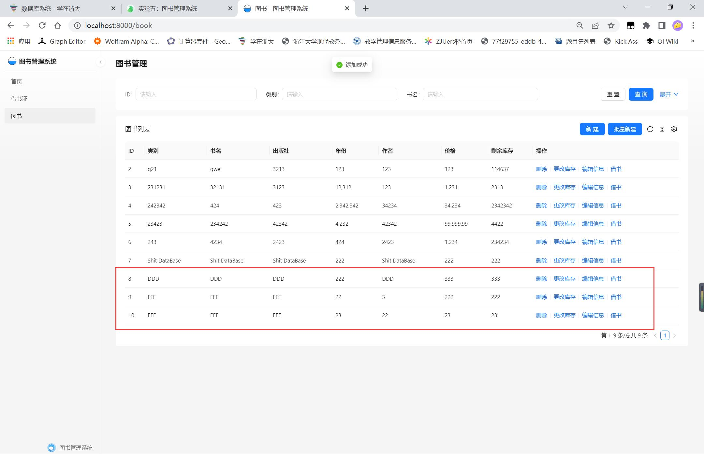

# Database System Lab 5

学号：3210105650 		姓名：邓铭辉


## 实验目的


设计并实现一个精简的图书管理程序，要求具有图书入库、查询、借书、还书、借书证管理等功能。

## 实验内容

提供一个基于MySQL(或OpenGauss, SQL Server)的精简图书管理程序，该图书管理程序应采用字符界面或图形界面的方式呈现，供用户操作使用。此外，该图书管理程序还应具备较好的可扩展性、鲁棒性和安全性，并且在高并发场景下仍能正确运行。

在实现图书管理程序后，提交实验成果，实验成果包括但不限于：

- 项目源代码：提交整个工程项目的压缩文件，至少应该包括src/目录下的所有文件以及pom.xml文件。提交工程项目时，请勿将以下文件提交：
  - 隐藏的.git/文件夹；
  - .gitignore中列出的那些需要被忽略的文件及文件夹，例如：target/、.idea/等。
  
实验报告：实验报告应包括实验目的、实验需求、实验环境、系统各模块的设计思路和实现、系统验证测试(包括功能性测试和正确性测试)、遇到的问题及解决方法、思考题的解答等。
通过本实验，提高学生的系统编程能力，加深对数据库系统原理及应用的理解。

### 系统整体架构的描述

#### 前端

框架:
Ant Design Pro + React + TypeScript + Redux

功能：
pages:
+ /Book 书籍管理
  + storeBook 增加书籍
  + incBookStock 增加库存
  + storeBooks 批量入库
  + removeBook 删除书籍
  + modifyBookInfo 修改书籍信息
  + queryBook 查询书籍
  + borrowBook 借书
+ /Card 借书证管理
  + registerCard 注册借书证
  + removeCard 删除借书证
  + showCards 查询借书证
  + showBorrowHistory 借书历史
  + borrowBook 借书
+ /Home 主页

components:
  + CreateForm 增加表单

##### 启动方式

```bash
cd frontend
npm install
npm start
```

#### 后端

框架：
Spring Boot + MySQL

功能：

com/library/restservice/BookController.java
@RestController
接受前端请求，调用LibraryManagementSystemImpl.java

com/library/restservice/RestServiceApplication.java
@SpringBootApplication
启动Spring Boot

com/example/incBookStockRequest.java
增加库存请求
定义Class

system/LibraryManagementSystemImpl.java
图书管理系统实现

entities
定义实体类


##### 启动方式

启动@SpringBootApplication


#### 接口

http://localhost:8080/storeBook 等
详见 com/library/restservice/BookController.java

### 描述程序设计中采用了的各项技术（如jsp，php，jdbc，odbc等等）

#### 前端

##### Ant Design Pro

Ant Design Pro 是一个企业级中后台前端/设计解决方案，基于 Ant Design 设计体系，用于研发企业级中后台产品。

**该项目主要使用 ProTable 进行表格的展示**

**通过不同的参数，ProTable 分别用做表单填写，表格展示，表格查询等功能**

##### React

React 是一个用于构建用户界面的 JavaScript 库， React 主要用于构建UI，很多人认为 React 是 MVC 中的 V（视图）。

React 通过组件的方式构建整个页面，通过组件的嵌套，可以构建出复杂的页面。

**该项目主要使用 React 处理前端页面的展示逻辑**

##### TypeScript

TypeScript 是 JavaScript 的一个超集，主要提供了类型系统和对 ES6 的支持。

TypeScript 可以在编译时发现潜在的问题，提高代码的可靠性和可维护性。

**该项目主要使用 TypeScript 编写前端代码，提高代码的可靠性和可维护性。**

##### Redux

Redux 是 JavaScript 状态容器，提供可预测化的状态管理。

Redux 可以让应用的状态变化变得可预测，易于调试。

**该项目主要使用 Redux 管理前端的状态，提高代码的可靠性和可维护性。**

#### 后端

##### Spring Boot

Spring Boot 是 Spring 框架的一套快速配置脚手架，可以基于 Spring Boot 快速开发单个微服务。

**该项目主要使用 Spring Boot 开发后端，提高开发效率，提供http接口。**

##### MySQL

MySQL 是一个关系型数据库管理系统，由瑞典 MySQL AB 公司开发，属于 Oracle 旗下产品。

**该项目主要使用 MySQL 存储数据。**

### 数据库表结构的描述

```sql
create table `book` (
    `book_id` int not null auto_increment,
    `category` varchar(63) not null,
    `title` varchar(63) not null,
    `press` varchar(63) not null,
    `publish_year` int not null,
    `author` varchar(63) not null,
    `price` decimal(7, 2) not null default 0.00,
    `stock` int not null default 0,
    primary key (`book_id`),
    unique (`category`, `press`, `author`, `title`, `publish_year`)
);

create table `card` (
    `card_id` int not null auto_increment,
    `name` varchar(63) not null,
    `department` varchar(63) not null,
    `type` char(1) not null,
    primary key (`card_id`),
    unique (`department`, `type`, `name`),
    check ( `type` in ('T', 'S') )
);

create table `borrow` (
  `card_id` int not null,
  `book_id` int not null,
  `borrow_time` bigint not null,
  `return_time` bigint not null default 0,
  primary key (`card_id`, `book_id`, `borrow_time`),
  foreign key (`card_id`) references `card`(`card_id`) on delete cascade on update cascade,
  foreign key (`book_id`) references `book`(`book_id`) on delete cascade on update cascade
);
```

### 每个功能模块的演示，以截图的方式演示每项功能，不需要在报告中贴出代码。

#### 图书入库模块


#### 图书增加库存模块


#### 图书批量入库模块


表单校验成功

表单校验失败




#### 图书删除模块


#### 图书修改模块


#### 图书查询模块


#### 借书模块


#### 还书模块


#### 借书记录查询模块


#### 借书证注册模块


#### 删除借书证模块


有书未还不能删除


#### 借书证查询模块

同上

### 最后提交的文件需要包括实验报告和源代码，以压缩文件格式上传。

## 实验感想

1. 真正的单人开发企业级项目
2. 第一次从头搭建Ant Design Pro和SpringBoot框架，虽然时间有点紧张，但还是能完成任务
3. 遇到的主要难点是SpringBoot和Ant Design Pro的整合，以及SpringBoot和MySQL的整合，还有前后端的交互
4. 在个人同时开发前后端的情况下，前后端的接口设计也是一个问题，在这个过程中，APIFox文档的使用和Postman的测试给我带来了很大的帮助
5. 使用了Git进行版本控制，这是一个很好的习惯
6. 由于时间紧张，没有进行并发性的测试
7. 报告有点赶工，希望助教手下留情


